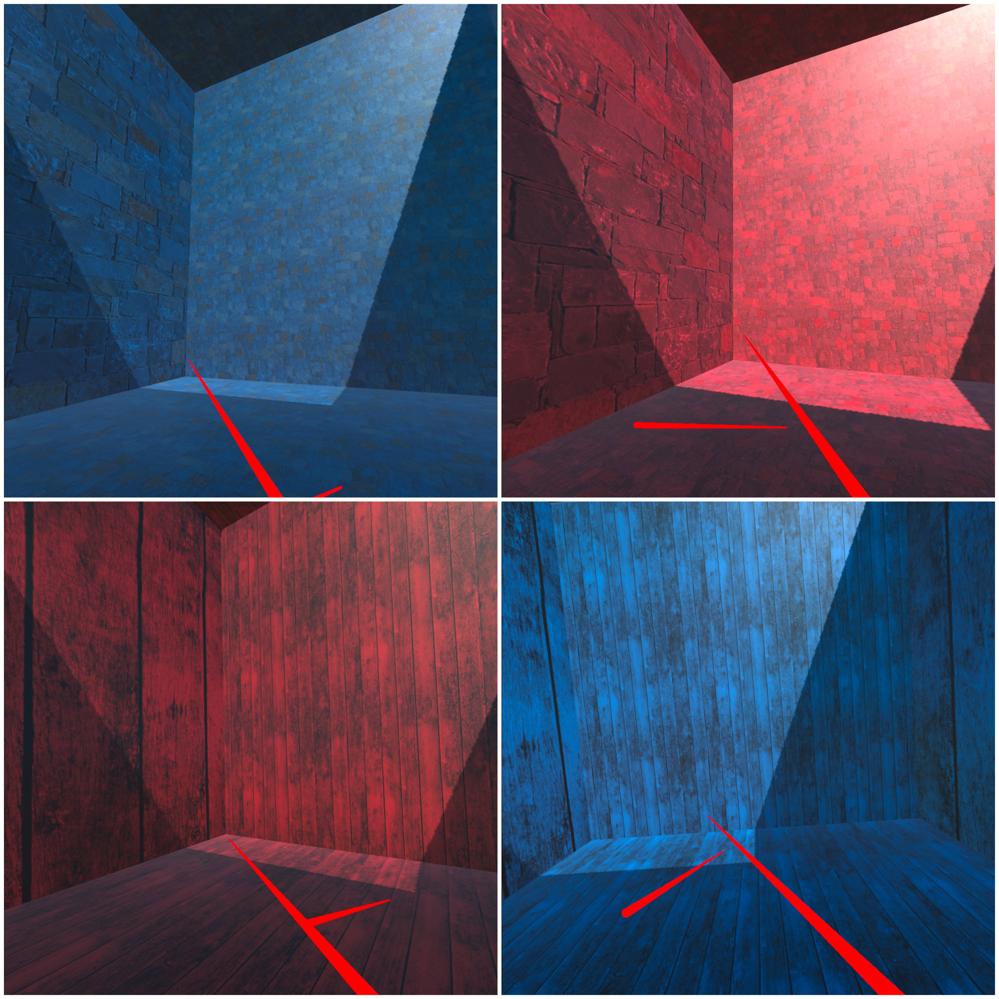

# MMI_VR_Color_Texture_TimePerception

## This is a study from the course "Forschungsseminar MMI" of the University of Regensburg.

### Members:
- Johanna Kalinin 
- Tina Peschek
- Thuy Linh Nguyen
- Leonie Handschmann

### Study Design:

We used a within-subject design. The independent variables were **COLORS** and **TEXTURES**. The examined colors are red and blue, and the textures are a brick texture and a wooden texture. In reference to the study of Davydenko and Peetz, we chose natural textures. They found out, that participants tend to overestimate time in nature setting but their stress level reduced resulting in a better mood. The duration that the participants estimate during their stay is measured and compared with the results of other studies 
To test the influence of colors and textures on time perception the participants were placed in virtual environments using VR glasses. For each of the four rooms we gave them the task to estimate the duration spent in the individual room.The duration ranges between 15 and 47 seconds and are assigned randomly to every round. To ensure that the estimated durations correlate with the specific rooms and are not coincidental, the procedure is repeated four times per room with the set time duration rotating (latin square design)

### Equipment:

For building the four different VR-Rooms we used the software Unity. To perform the study we used the VR Glasses Oculus Quest 2.

### Procedure:
After welcoming a participant we explained the aim and procedure of the study. In case of consent by the participant, the participant is given a questionnaire on demographics. 
After completing the questionaire, they enter the virtual rooms using the VR glasses. After each session, the participants are asked to estimate the duration they have spent in each room.
Each participant goes through each room option four times, meaning the measuring procedure is repeated 16 times in total. After the participants focused on assessing the time, they were asked to enter the rooms again concentrating on the textures and colours. The study is concluded with an questionnaire on the effect of the colour and texture on their individual time perception and attitude towards the presented colors and textures.

### Rooms:

### Links to Questionnaires:
Demographic: https://forms.gle/F16Yk6rpvSefuaGk6
Time Perception: https://forms.gle/jR8oBsrmhQ9BebR68
Colors & Textures: https://forms.gle/GTjpYQ9BzTNjzdW7A

### Link to Overleaf Project:
https://de.overleaf.com/project/617ab5602661b942a9e0d7c8
